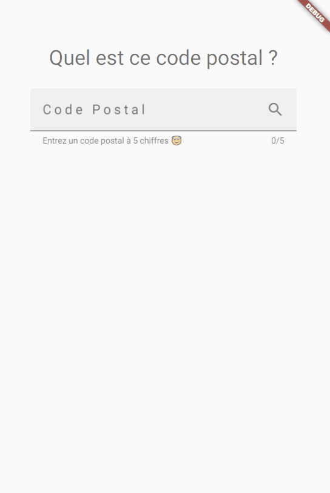

# quel_est_ce_code_postal

"Quel est ce code postal" est une application mobile et web codé avec Flutter qui donne la ou les villes associée(s) au code postal recherché.

Cette application utilise l' *Open API*  [API Carto - module Codes Postaux](https://api.gouv.fr/les-api/api_carto_codes_postaux).

Voir [la démo](https://quel-est-ce-code-postal.web.app/#/) :  

# Installation 

- Installer Flutter

# Lancement 

Sur mobile :
- `flutter run`

Sur Google Chrome :
- `flutter run -d chrome`

# Preview

## On chrome

# Tester localement

- Installer [Firebase CLI](https://firebase.google.com/docs/cli)
- Lancer la commande : `firebase emulators:start`

# Deployer en direct

Lancer la commande : `firebase deploy --only hosting`

Cette commande déploiera le site sur l'url : https://quel-est-ce-code-postal.web.app/