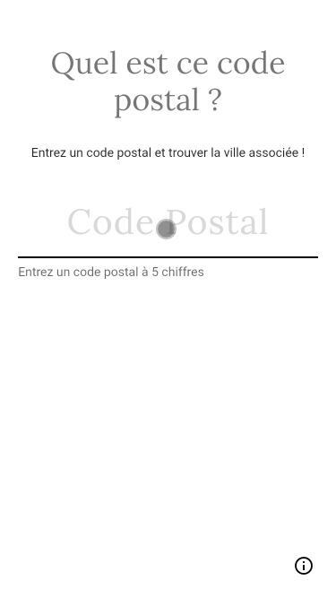

# quel_est_ce_code_postal

"Quel est ce code postal" est une application mobile et web codé avec Flutter qui donne la ou les villes associée(s) au code postal recherché.

Cette application utilise l' *Open API*  [API Carto - module Codes Postaux](https://api.gouv.fr/les-api/api_carto_codes_postaux).

# Installation 

- Installer Flutter

# Lancement 

Sur mobile :
- `flutter run`

Sur Google Chrome :
- `flutter run -d chrome`

# Preview

## On chrome

